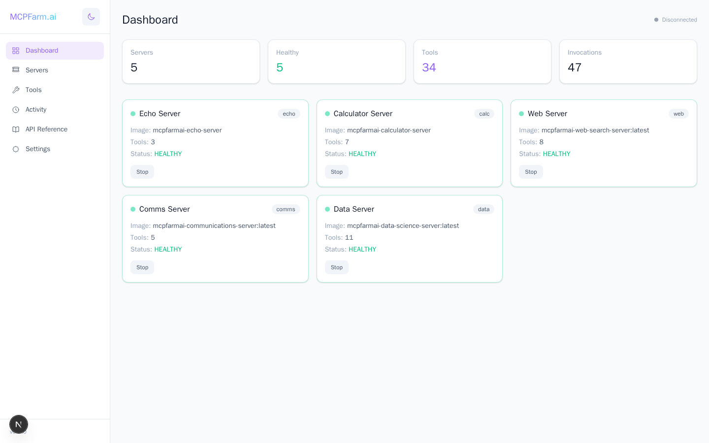
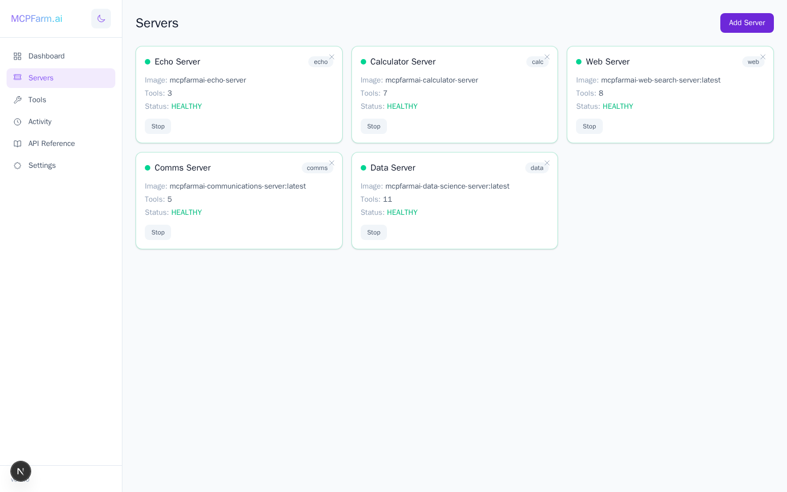
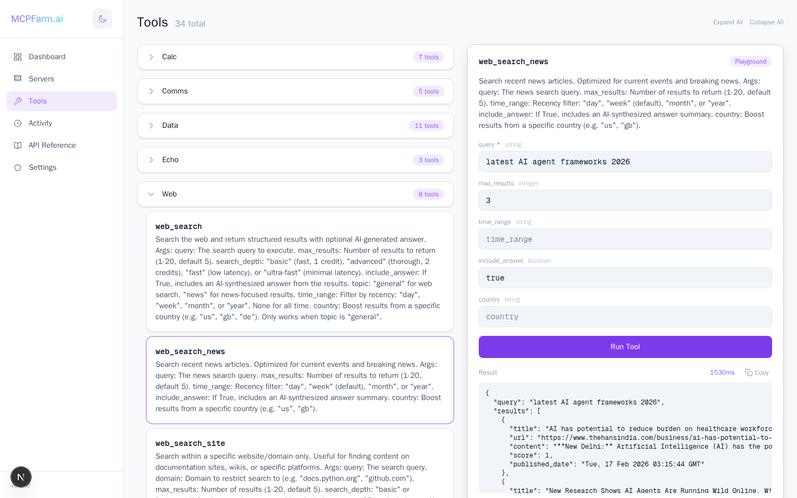
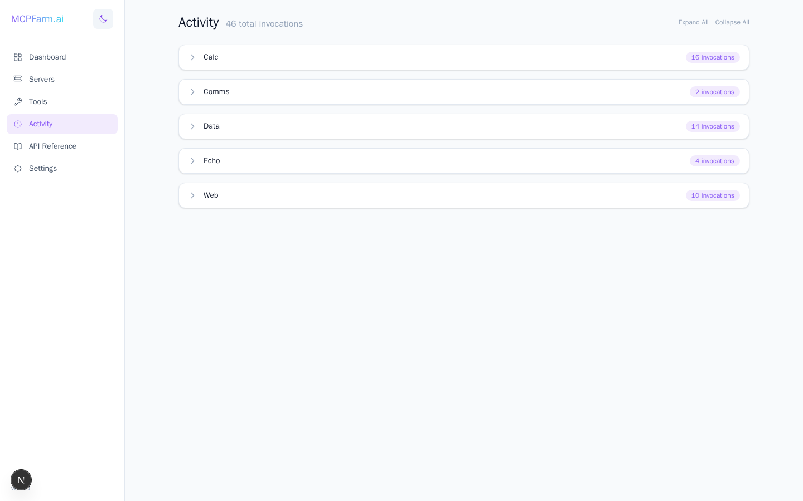
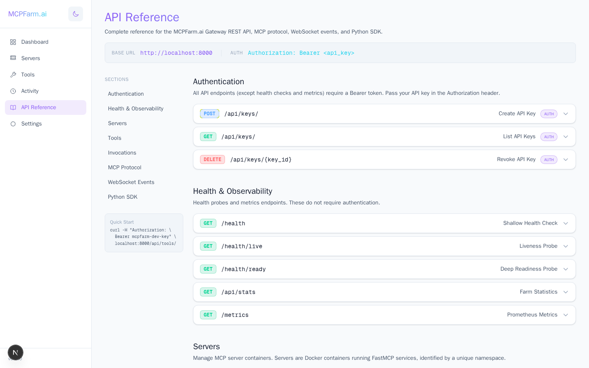
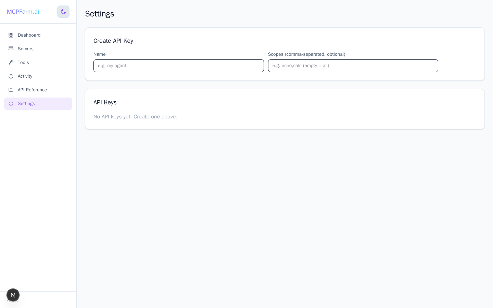

<div align="center">

# MCPFarm.ai

### A dynamic MCP server farm for managing, monitoring, and orchestrating AI tools at scale

[](LICENSE)
[](https://python.org)
[](https://nextjs.org)
[](https://docker.com)
[](https://modelcontextprotocol.io)

</div>

---

MCPFarm.ai is an open-source platform that turns isolated MCP (Model Context Protocol) servers into a **unified, managed tool farm**. Deploy any FastMCP server as a Docker container, and MCPFarm auto-discovers its tools, exposes them through a single gateway, and gives you a real-time dashboard to monitor everything.

Think of it as **Kubernetes for AI tools** — but purpose-built for the MCP ecosystem.

<picture>
  <source media="(prefers-color-scheme: dark)" srcset="docs/images/dashboard-dark.png">
  <source media="(prefers-color-scheme: light)" srcset="docs/images/dashboard-light.png">
  
</picture>

## Why MCPFarm?

The MCP protocol is powerful — but running multiple MCP servers means managing separate processes, ports, auth, and discovery. MCPFarm solves this:

| Problem | MCPFarm Solution |
|---------|-----------------|
| Each server needs its own port & process | **Single gateway** multiplexes all servers |
| No central tool discovery | **Auto-discovery** from Docker containers |
| No auth on MCP servers | **API key authentication** with rate limiting |
| No visibility into tool usage | **Real-time dashboard** with invocation tracking |
| Hard to integrate with agent frameworks | **Python SDK** with LangChain/LangGraph support |
| No health monitoring | **Auto-restart**, health checks, Prometheus metrics |

## Features

### Dynamic Server Management

Add, remove, start, and stop MCP servers without restarting the gateway. Each server runs in its own Docker container with automatic health monitoring and restart capabilities.

<picture>
  <source media="(prefers-color-scheme: dark)" srcset="docs/images/servers-dark.png">
  <source media="(prefers-color-scheme: light)" srcset="docs/images/servers-light.png">
  
</picture>

### Unified Tool Registry

Every tool from every server is namespaced and discoverable through a single API. Browse all 34 tools across 5 servers, see their schemas, and test them directly in the built-in playground with live results and copy-to-clipboard.

<picture>
  <source media="(prefers-color-scheme: dark)" srcset="docs/images/tools-playground-dark.png">
  <source media="(prefers-color-scheme: light)" srcset="docs/images/tools-playground-light.png">
  
</picture>

### Real-Time Activity Monitoring

Track every tool invocation with timing, arguments, results, and error states. WebSocket-powered live updates keep the dashboard current.

<picture>
  <source media="(prefers-color-scheme: dark)" srcset="docs/images/activity-dark.png">
  <source media="(prefers-color-scheme: light)" srcset="docs/images/activity-light.png">
  
</picture>

### Comprehensive API Reference

Built-in interactive API documentation covering every endpoint, the MCP protocol bridge, WebSocket events, and the Python SDK.

<picture>
  <source media="(prefers-color-scheme: dark)" srcset="docs/images/api-reference-dark.png">
  <source media="(prefers-color-scheme: light)" srcset="docs/images/api-reference-light.png">
  
</picture>

## Architecture

```
                    ┌──────────────────────────────────────────────────┐
                    │                MCPFarm Gateway                    │
  Agents ──────────▶│                                                  │
  (LangGraph,       │  ┌──────────┐  ┌───────────┐  ┌──────────────┐ │
   CrewAI,          │  │ REST API │  │ MCP Bridge│  │  WebSocket   │ │
   AutoGen, ...)    │  └────┬─────┘  └─────┬─────┘  └──────┬───────┘ │
                    │       │              │                │         │
                    │  ┌────▼──────────────▼────────────────▼───────┐ │
                    │  │          Tool Registry & Router             │ │
                    │  └──┬─────────┬──────────┬──────────┬────┬───┘ │
                    │     │         │          │          │    │     │
                    └─────┼─────────┼──────────┼──────────┼────┼─────┘
                          │         │          │          │    │
          ┌───────────────┘    ┌────┘    ┌─────┘    ┌─────┘   └──────┐
          ▼                    ▼         ▼          ▼                ▼
   ┌────────────┐  ┌────────────┐  ┌──────────┐  ┌──────────┐  ┌──────────┐
   │   Echo     │  │ Calculator │  │Web Search│  │  Data    │  │  Comms   │
   │ (FastMCP)  │  │ (FastMCP)  │  │(FastMCP) │  │ Science  │  │(FastMCP) │
   │  3 tools   │  │  7 tools   │  │ 8 tools  │  │ 11 tools │  │ 5 tools  │
   └────────────┘  └────────────┘  └──────────┘  └──────────┘  └──────────┘
      Docker          Docker          Docker         Docker        Docker
```

**Key design principles:**

- **Farm-first architecture** — The gateway is a multiplexer, not a monolith. Servers are cattle, not pets.
- **Auto-discovery** — Drop a Docker container with the `mcpfarm.managed=true` label and it's automatically registered.
- **Namespace isolation** — Every tool is prefixed with its server namespace (`calc_add`, `echo_echo`) to avoid collisions.
- **Dual protocol** — Expose tools via both REST API (for simplicity) and native MCP protocol (for full compatibility).
- **Observable by default** — Structured logging, Prometheus metrics, and a Grafana dashboard ship out of the box.

## Quick Start

### Prerequisites

- Docker & Docker Compose
- Git

### 1. Clone & Start

```bash
git clone https://github.com/iotlodge/mcpfarm.ai.git
cd mcpfarm.ai
cp .env.example .env

# Start everything
docker compose up --build -d
```

### 2. Access the Dashboard

| Service | URL |
|---------|-----|
| Frontend | [http://localhost:3100](http://localhost:3100) |
| Gateway API | [http://localhost:8000](http://localhost:8000) |
| Health Check | [http://localhost:8000/health](http://localhost:8000/health) |
| Metrics | [http://localhost:8000/metrics](http://localhost:8000/metrics) |

### 3. Call a Tool

```bash
# List all available tools
curl -H "Authorization: Bearer mcpfarm-dev-key" \
  http://localhost:8000/api/tools/

# Call the calculator
curl -X POST http://localhost:8000/api/tools/call \
  -H "Authorization: Bearer mcpfarm-dev-key" \
  -H "Content-Type: application/json" \
  -d '{"tool_name": "calc_add", "arguments": {"a": 42, "b": 58}}'

# Response: {"result": 100.0, "duration_ms": 82, "invocation_id": "..."}
```

### 4. Use the Python SDK

```bash
pip install -e ./sdk
```

```python
from mcpfarm_sdk import MCPFarmClient

client = MCPFarmClient(
    url="http://localhost:8000/mcp",
    api_key="mcpfarm-dev-key"
)

# Call a tool directly
result = await client.call_tool("calc_multiply", {"a": 7, "b": 6})
print(result)  # 42.0

# Get LangChain-compatible tools for agent frameworks
tools = await client.create_tools()  # Returns List[StructuredTool]
```

## Included MCP Servers

MCPFarm ships with five servers and **34 tools** to get you started:

| Server | Namespace | Tools | Description |
|--------|-----------|-------|-------------|
| **Echo** | `echo` | 3 | Echo, reverse, and uppercase — great for testing |
| **Calculator** | `calc` | 7 | Add, subtract, multiply, divide, power, sqrt, modulo |
| **Web Search** | `web` | 8 | Tavily-powered search, news, site search, crawl, extract, URL mapping |
| **Data Science** | `data` | 11 | NumPy/Pandas statistics, correlations, distributions, CSV analysis |
| **Communications** | `comms` | 5 | Gmail send/read/search, WhatsApp messaging (requires credentials) |

### Adding Your Own Server

Any FastMCP server can join the farm. Create a Dockerfile, add it to `docker-compose.yml`:

```yaml
my-custom-server:
  build:
    context: ./servers/my_server
  networks:
    - mcpfarm_internal
  labels:
    - "mcpfarm.managed=true"
    - "mcpfarm.namespace=custom"
```

The gateway auto-discovers it on startup. Your tools appear in the dashboard within seconds.

## Agent Integration

MCPFarm is built for agentic workflows. The SDK provides first-class support for LangChain and LangGraph.

### LangGraph ReAct Agent

```python
from langgraph.graph import END, MessagesState, StateGraph
from langgraph.prebuilt import ToolNode
from langchain_openai import ChatOpenAI
from mcpfarm_sdk import MCPFarmClient

# Connect to the farm
client = MCPFarmClient(url="http://localhost:8000/mcp", api_key="your-key")
tools = await client.create_tools()

# Build a ReAct agent with all farm tools
llm = ChatOpenAI(model="gpt-4o").bind_tools(tools)

graph = StateGraph(MessagesState)
graph.add_node("agent", lambda s: {"messages": [llm.invoke(s["messages"])]})
graph.add_node("tools", ToolNode(tools))
graph.set_entry_point("agent")
graph.add_conditional_edges("agent", should_continue, {"tools": "tools", END: END})
graph.add_edge("tools", "agent")

app = graph.compile()
result = await app.ainvoke({"messages": [HumanMessage(content="Add 5 and 3, then echo the result")]})
```

Run the included demo:

```bash
cd examples
cp .env.example .env  # Add your LLM API key
uv run python langgraph_agent.py "What is the square root of 144?"
```

## Observability

MCPFarm ships with a full observability stack.

### Structured Logging

All gateway logs are structured via [structlog](https://www.structlog.org/). Colored console output in development, JSON lines in production.

```bash
# Dev mode (default)
GATEWAY_LOG_FORMAT=console

# Production
GATEWAY_LOG_FORMAT=json
```

### Prometheus Metrics

The `/metrics` endpoint exposes:

| Metric | Type | Description |
|--------|------|-------------|
| `mcpfarm_http_requests_total` | Counter | HTTP requests by method, path, status |
| `mcpfarm_http_request_duration_seconds` | Histogram | Request latency percentiles |
| `mcpfarm_tool_invocations_total` | Counter | Tool calls by name, server, status |
| `mcpfarm_tool_invocation_duration_seconds` | Histogram | Tool call latency |
| `mcpfarm_servers_total` | Gauge | Servers by health status |
| `mcpfarm_websocket_connections` | Gauge | Active WebSocket connections |
| `mcpfarm_auth_failures_total` | Counter | Auth failures by reason |

### Grafana Dashboard

Start the observability stack for a pre-built dashboard:

```bash
# Start with Prometheus + Grafana
docker compose -f docker-compose.yml -f docker-compose.observability.yml up --build -d

# Grafana: http://localhost:3000 (admin / mcpfarm)
```

### Health Probes

| Endpoint | Purpose |
|----------|---------|
| `GET /health` | Shallow health check (gateway up) |
| `GET /health/live` | Liveness probe (for container orchestrators) |
| `GET /health/ready` | Deep readiness (checks DB, Redis, server count) |

## Project Structure

```
mcpfarm.ai/
├── gateway/                    # FastAPI gateway service
│   └── src/mcpfarm_gateway/
│       ├── api/                # REST endpoints (servers, tools, keys, health)
│       ├── containers/         # Docker container management & health watching
│       ├── mcp/                # MCP protocol bridge (FastMCP)
│       ├── realtime/           # WebSocket hub for live updates
│       ├── db/                 # SQLAlchemy models & repositories
│       └── observability/      # Logging, metrics, middleware
├── frontend/                   # Next.js 15 dashboard
│   └── src/app/                # App Router pages
├── sdk/                        # Python SDK (mcpfarm-sdk)
│   └── src/mcpfarm_sdk/        # Client, tools, LangChain integration
├── servers/                    # MCP server implementations
│   ├── echo/                   # Echo server (3 tools)
│   ├── calculator/             # Calculator server (7 tools)
│   ├── web_search/             # Tavily web search server (8 tools)
│   ├── data_science/           # NumPy/Pandas data science server (11 tools)
│   └── communications/         # Gmail & WhatsApp server (5 tools)
├── examples/                   # Agent demos (LangGraph)
├── infra/                      # Prometheus, Grafana configs
├── scripts/                    # Management scripts (start, stop, restart)
├── docker-compose.yml          # Core services
└── docker-compose.observability.yml  # Prometheus + Grafana overlay
```

## Management Scripts

```bash
./scripts/start.sh              # Start all services
./scripts/start.sh --obs        # Start with observability stack
./scripts/stop.sh               # Stop all services
./scripts/stop.sh --all         # Stop including observability
./scripts/restart.sh            # Rebuild and restart
./scripts/push.sh               # Commit and push to GitHub
```

## Configuration

Key environment variables (see `.env.example` for all):

| Variable | Default | Description |
|----------|---------|-------------|
| `ADMIN_API_KEY` | `mcpfarm-dev-key` | API key for authentication |
| `GATEWAY_LOG_LEVEL` | `info` | Log level (debug, info, warning, error) |
| `GATEWAY_LOG_FORMAT` | `console` | Log format (console, json) |
| `ENABLE_METRICS` | `true` | Enable Prometheus metrics |
| `TAVILY_API_KEY` | — | Tavily API key for web search server |
| `GMAIL_ADDRESS` | — | Gmail address for communications server |
| `GMAIL_APP_PASSWORD` | — | Gmail app password for communications server |
| `WHATSAPP_TOKEN` | — | WhatsApp API token for communications server |
| `DATABASE_URL` | (auto) | PostgreSQL connection string |
| `REDIS_URL` | (auto) | Redis connection string |

## Tech Stack

| Layer | Technology |
|-------|-----------|
| **Gateway** | Python 3.12, FastAPI, FastMCP, SQLAlchemy, asyncpg |
| **Frontend** | Next.js 15, React 19, TypeScript, Tailwind CSS |
| **Database** | PostgreSQL 16 |
| **Cache** | Redis 7 |
| **Proxy** | Traefik v3 |
| **Observability** | structlog, prometheus-client, Grafana |
| **SDK** | Python, httpx, Pydantic, LangChain adapters |
| **Containers** | Docker, Docker Compose |

## Settings

Manage API keys and view system configuration from the Settings page.

<picture>
  <source media="(prefers-color-scheme: dark)" srcset="docs/images/settings-dark.png">
  <source media="(prefers-color-scheme: light)" srcset="docs/images/settings-light.png">
  
</picture>

## Roadmap

- [ ] MCP server marketplace / registry
- [ ] Multi-tenant support with workspace isolation
- [ ] OpenTelemetry distributed tracing
- [ ] Server scaling (multiple replicas per namespace)
- [ ] Built-in tool composition (chain tools into workflows)
- [ ] Claude Desktop & Cursor integration profiles
- [ ] Helm chart for Kubernetes deployment

## Contributing

Contributions are welcome! Please open an issue or submit a pull request.

## License

MIT License. See [LICENSE](LICENSE) for details.

---

<div align="center">

Built with [FastMCP](https://github.com/jlowin/fastmcp) and the [Model Context Protocol](https://modelcontextprotocol.io)

</div>
